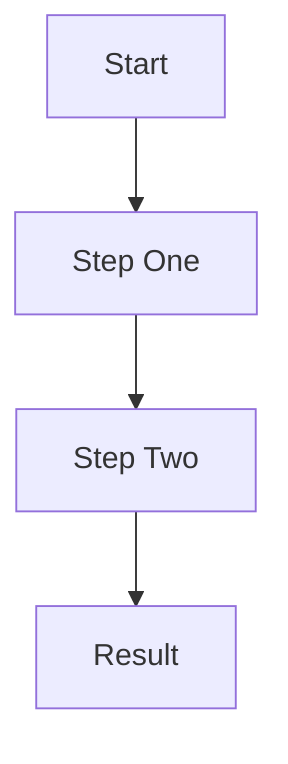

# Your Name

## Your Title | Your Focus Area

**Contact & Links**

[GitHub](https://github.com/your-username) | [LinkedIn](https://linkedin.com/in/your-username) | [Blog or Website](https://your-site.dev) | <your-email@example.com>

**Location:** City, ST | **Open to:** Internships, Entry-level roles, Remote, Hybrid

<!--
HOW TO USE THIS TEMPLATE
- Replace all placeholder text with your own information.
- Delete any section you don't need yet. You can add it back as your portfolio grows.
- Delete these HTML comments before publishing. They don't show up when rendered.
- Keep headings in order (# then ## then ###) so the page is easy to scan.
- Never include private information such as a home address, phone number you don't want public, or passwords.
- Look at the example portfolios (Chad Hackerman and Brian Codington) to see how each section looks when it's filled in.
-->

---

## About Me

Write 2-4 sentences about who you are, what you're studying, and the kind of role you want. Mention one or two specific things you're proud of or curious about.

---

## Featured Projects

Link each project to its own page in the `projects/` folder (see `project-template.md`). Pick your best 3-5.

- [Project Name](projects/project-name.md) - One-line description of what it is and what it does
- [Project Name](projects/project-name.md) - One-line description of what it is and what it does
- [Project Name](projects/project-name.md) - One-line description of what it is and what it does

<!--
Prefer a table? Use this instead:

| Project | Description | Tech Stack |
|---|---|---|
| [Project Name](projects/project-name.md) | One-line description | Tool, Tool, Language |
-->

---

## Experience

Include jobs, internships, work-study, volunteer work, or club leadership. Early in your career, a school or lab project can go here too.

### Job Title

**Organization Name** | *Month Year - Present*

One or two sentences about what the role involved.

**Key Responsibilities:**

- Start with an action verb and say what you did
- Include a number when you can (people helped, time saved, systems managed)
- Focus on results, not just duties

**Notable Projects:**

- [Project Name](projects/project-name.md) - Short description
  * Result or metric
  * Tech Stack: Tool, Tool, Tool

**Technical Environment:** Tool, Platform, Language

---

## Technical Skills

### Category (for example, Security Tools or Frontend)

- Skill, Skill, Skill

### Category (for example, Programming or Backend)

- Language (level) - what you use it for
- Language (level) - what you use it for

### Category (for example, Operating Systems or DevOps)

- Skill, Skill, Skill

<!--
Be honest about your level. A short, accurate list is better than a long one you can't back up.
-->

---

## Key Achievements

1. Specific achievement with a number or outcome
2. Specific achievement with a number or outcome
3. Specific achievement with a number or outcome

---

## Code Samples

Show short, readable snippets (under about 30 lines) that you wrote yourself. Say what each one does.

### Language - Short Title

```python
# Replace with your own code
def example():
    return "Explain what this does and why it matters"
```

---

## Project Showcase

Screenshots, photos, and diagrams make your work real. Store images in an `images/` folder and always write alt text.

### Project or Setup Name


One or two sentences explaining what the image shows and why it matters.

### Diagram Example



Short explanation of what the diagram shows.

<!--
Blur or remove anything sensitive from screenshots: real IP addresses, usernames, keys, tokens, and emails.
-->

---

## Education & Certifications

### Degree Name

**School Name** | *Start Year - Graduation Year*

- GPA (optional, only if strong)
- Focus: Area, Area
- Relevant coursework: Course, Course

### Certifications

- **Certification Name** - Issuer (Year, or "In progress")
- **Certification Name** - Issuer (Year, or "In progress")

---

*Last updated: Month Year*
