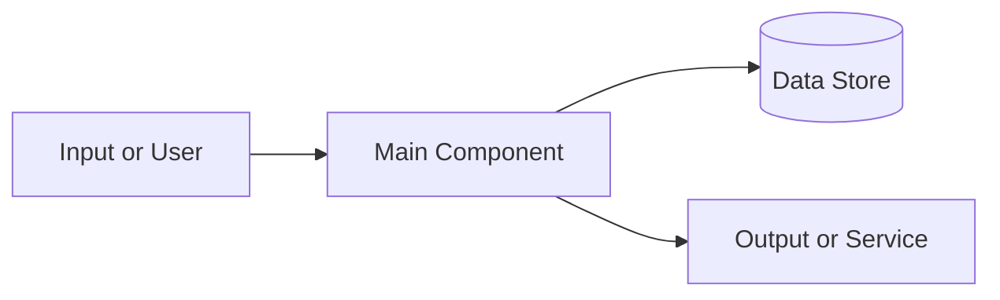

# Project Name

**One-line summary of what this project is and why it matters.**

<!--
HOW TO USE THIS TEMPLATE
- Copy this file into your portfolio's projects/ folder and rename it (for example, homelab.md or task-manager.md).
- Replace the placeholder text with your own details.
- Delete any section that doesn't apply. Not every project needs every section.
- Delete these HTML comments before publishing.
- Never include real passwords, API keys, tokens, or private IP addresses. Blur or remove them from screenshots and code.
- The Chad Hackerman and Brian Codington portfolios show finished project pages for reference.
-->

| | |
|---|---|
| **Type** | Personal / Class / Work / CTF / Open source |
| **Timeframe** | Month Year - Month Year |
| **Role** | Solo, or what you specifically did on a team |
| **Tech Stack** | Language, Framework, Tool, Platform |
| **Links** | [Source code](https://github.com/your-username/repo) / [Live demo](https://example.com) |

---

## Overview

Two to four sentences. What did you build or investigate, who is it for, and what does it do?

## The Problem

What problem were you solving, or what question were you answering? Why did it matter?

## Key Features

- Feature or capability one
- Feature or capability two
- Feature or capability three

## Architecture

Describe how the pieces fit together. A diagram is worth a lot here.



*Caption explaining what the diagram shows.*

## How I Built It

1. **Step one:** what you did and why you chose that approach
2. **Step two:** what you did and why
3. **Step three:** what you did and why

## Code Sample

Show the most interesting part, not the whole project. Keep it short and explain it.

```python
# Replace with a short snippet from your own project
def example():
    return "Explain what this does and why it matters"
```

What this code does and why you wrote it this way.

## Results

Use specifics and numbers wherever you can.

- Result with a number (for example, "Scanned 500+ hosts per hour")
- Result with a number (for example, "Reduced load time by 40%")
- What worked well


*Caption explaining what the screenshot shows.*

## Challenges and Solutions

- **Challenge:** something that went wrong or was hard
  **Solution:** how you figured it out

- **Challenge:** another obstacle
  **Solution:** how you handled it

## What I Learned

Two to four sentences on the skills you gained and what you would do differently next time.

## Next Steps

- Improvement or feature you'd add
- Something you'd like to explore further

---

[← Back to portfolio](../README.md)
